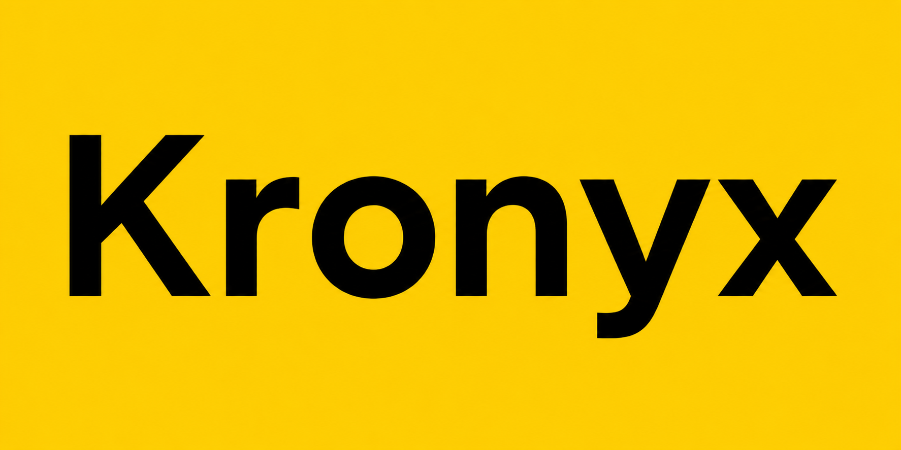

<p align="center">
  <a href="https://github.com/BillyMuthiani/Kronyx">
    
  </a>
</p>

<h1 align="center">Kronyx</h1>

<p align="center">
<b>Built from Scratch • NumPy Powered • Educational Deep Learning Framework</b>
</p>

<p align="center">
A lightweight deep learning framework that makes neural networks easy to learn, inspect, visualize, and build.
</p>

<p align="center">

[](https://pypi.org/project/kronyx/)
[](https://pypi.org/project/kronyx/)
[](LICENSE)
[](https://github.com/BillyMuthiani/Kronyx/actions)
[](https://kronyx.github.io/kronyx)

</p>

---

## Why Kronyx?

Most deep learning frameworks are designed primarily for production.

**Kronyx is designed to help you understand deep learning.**

Whether you're learning neural networks, teaching machine learning, prototyping new ideas, or building lightweight AI applications, Kronyx provides a familiar Keras-like API with tools that make every layer transparent.

### What makes Kronyx different?

- Built entirely from **NumPy**
- Designed for **education first**
- 📈 Built-in training visualizations (`history.plot()`)
- Rich model inspection (`model.summary()`)
- Architecture visualization (`model.visualize()`)
- Native `.krx` model serialization
- ⚡ Lightweight with zero heavyweight ML dependencies
- Familiar Sequential API inspired by Keras
- 📦 Installable directly from PyPI

---

## 🚀 Installation

```bash
pip install kronyx
```

For development:

```bash
git clone https://github.com/BillyMuthiani/Kronyx.git

cd Kronyx

pip install -e ".[dev]"
```

For plotting support:

```bash
pip install kronyx[plotting]
```

For DataFrame support:

```bash
pip install kronyx[dataframe]
```

---

## ⚡ Quick Example

```python
import numpy as np
from kronyx import *

X = np.array([
    [0,0],
    [0,1],
    [1,0],
    [1,1]
])

y = np.array([
    [0],
    [1],
    [1],
    [0]
])

model = Sequential()

model.add(Dense(2,16))
model.add(ReLU())

model.add(Dense(16,1))
model.add(Sigmoid())

model.compile(
    loss=BinaryCrossEntropy(),
    optimizer=Adam(),
    metric=Accuracy()
)

history = model.fit(X,y,epochs=1000)

history.plot()

model.summary()

model.visualize()

model.save("xor.krx")
```

---

# Features

| Category | Features |
|:---------|:---------|
| **Core** | Pure NumPy backend, Keras-like Sequential API |
| **Education** | Built for learning neural networks, `model.summary()`, `model.visualize()` |
| **Visualization** | Native SVG architecture diagrams, training curves, decision boundaries, confusion matrices |
| **Visualization Engine** | Layered pipeline: GraphBuilder → Layout → SceneStyler → Renderer. Themes, icons, registry-based plugins |
| **Optimization** | SGD, Adam |
| **Losses** | BinaryCrossEntropy, CategoricalCrossEntropy, SoftmaxCategoricalCrossEntropy |
| **Metrics** | Accuracy, BinaryAccuracy, CategoricalAccuracy, Precision, Recall, F1Score, ConfusionMatrix, TopKAccuracy |
| **Callbacks** | EarlyStopping, CSVLogger, ModelCheckpoint, ReduceLROnPlateau |
| **Preprocessing** | StandardScaler, MinMaxScaler, RobustScaler, OneHotEncoder |
| **Datasets** | xor, spiral, circles, moons, blobs, iris |
| **Data Utilities** | train_test_split, BatchLoader, TensorDataset |
| **Serialization** | `.krx` format |
| **Quality** | mypy type checking, Ruff linting |
| **Distribution** | PyPI |

---

## 🖼️ Native Visualization Engine

Kronyx includes a renderer-independent visualization engine for generating model architecture diagrams.

### Pipeline

```
Sequential Model
    ↓
GraphBuilder
    ↓
Graph
    ↓
Layout Engine
    ↓
Scene
    ↓
Scene Styler
    ↓
Renderer
    ↓
SVG Output
```

### Components

| Component | Responsibility |
|:----------|:---------------|
| **GraphBuilder** | Inspects a Sequential model and produces an intermediate `Graph` |
| **Graph** | Immutable model structure (`Node`s and `Edge`s) |
| **LayoutEngine** | Computes node positions and canvas dimensions |
| **LayoutRegistry** | Plugin catalog for layout engines |
| **SceneStyler** | Applies themes, fonts, colors, and icons to produce a `StyledScene` |
| **RendererRegistry** | Plugin catalog for renderers |
| **ThemeRegistry** | Plugin catalog for visual themes |
| **IconRegistry** | Plugin catalog for layer icons |
| **SvgRenderer** | Paints a `StyledScene` into an SVG string |

### Capabilities

- Native SVG rendering without Graphviz
- Vertical layout with runtime theme support
- Layer-specific semantic icons
- Registry-based plugin system for layouts, renderers, themes, and icons
- Renderer-independent architecture (SVG, PNG, PDF, HTML, ASCII)

### Quick Example

```python
from kronyx import Sequential, Dense, ReLU

model = Sequential()
model.add(Dense(2, 16))
model.add(ReLU())
model.add(Dense(16, 1))

model.visualize(output_format="svg")
```

This generates `model_architecture.svg` using the native visualization pipeline.

---

# Documentation

| Guide | Description |
|--------|-------------|
| [Getting Started](docs/getting_started.md) | Installation and first model |
| [Sequential API](docs/sequential.md) | Building models |
| [Layers](docs/layers.md) | Dense, Conv2D, Flatten, Dropout |
| [Callbacks](docs/callbacks.md) | EarlyStopping, CSVLogger |
| [Serialization](docs/serialization.md) | Saving and loading `.krx` models |
| [Examples](docs/examples.md) | Complete working examples |
| [Roadmap](ROADMAP.md) | Future development |
| [Changelog](CHANGELOG.md) | Release history |

# 🌟 Vision

Kronyx exists to make deep learning understandable.

Instead of treating neural networks as black boxes, Kronyx exposes every layer, every parameter, and every training step through intuitive visualization and inspection tools.

Our mission is to become the best framework for learning how deep learning works under the hood.

---

<p align="center">

Made with ❤️ using NumPy.

⭐ If Kronyx helps you learn or build, consider giving the repository a star.

</p>